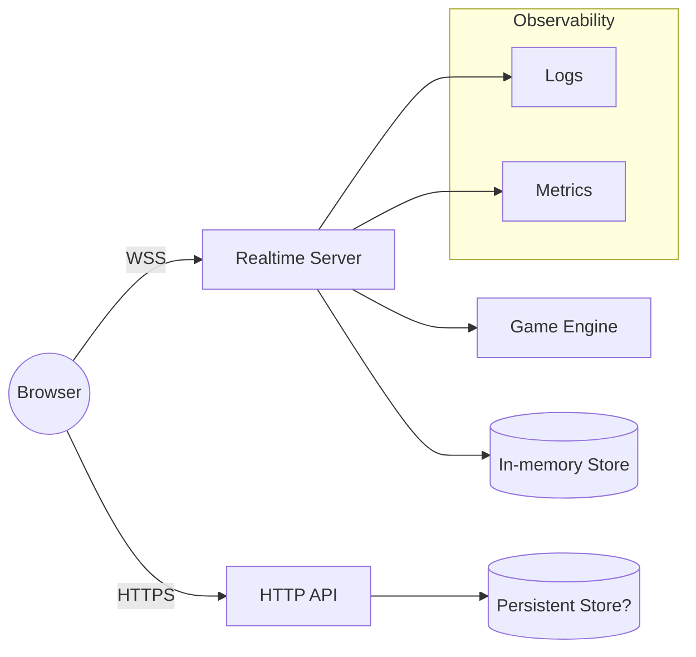

# 基本設計（ハイレベル）

- バージョン: 0.6 (ドラフト)
- 更新日: YYYY-MM-DD

## 1. 目的
- オンライン対戦型マインスイーパーを低レイテンシかつ整合的に同期させる。

## 2. 全体構成図（MVP）

## 3. コンポーネント一覧
- Client: 盤面レンダリング、入力、WS 接続、（MVPは非楽観）
- HTTP API: ルーム作成/参加の初期ハンドシェイク
- Realtime Server: ルーム/接続管理、順序付け、ブロードキャスト
- Game Engine: 盤面生成（シード/初手セーフ）、操作判定（連鎖展開/勝敗/スコア）
- Turn Manager: 手番の制御、1手制約、旗連打制限
- Chess Clock: 残り時間管理（初期60s/+2s）、サーバー権威で同期
- Storage: Durable Objects にルーム状態を保持（将来: D1/KV を併用）

## 4. データフロー
- HTTP でルームとトークンを取得 → WS 接続 → `game:started`（timeControl含む） → 手番プレイヤーが操作 → 判定/スコア/クロック更新 → ターン移行 → 終了判定

## 5. 技術選定（方針）
- 低レイテンシな全二重通信: WebSocket（ADR 参照）
- サーバー権威モデル: クライアントは隠し情報を保持しない
- ランタイム/ホスティング: Cloudflare Workers + Durable Objects（ADR-0003）
- Web フレームワーク: Hono（TS）/ Wrangler / Miniflare
- フロント: Vite + React（Cloudflare Pages）
- 型/検証: TypeScript + Zod

## 6. ストレージ方針（概要）
- ルーム状態（盤面・フラグ・進行状態）は DO に保持（短期・整合性重視）。
- 永続化が必要なデータ（ユーザー/試合履歴/ランキング等）は D1 に保存（将来）。
- デイリーシードや一時トークン等は KV を使用可。

## 6. UX 方針（スマホ）
- 操作: タップ=開く、長押し=旗、ズーム/パンをサポート
- 開始: Ready は不要。ホストが開始し、全員同時スタート
- 旗: ルーム共有で同期。チョードは共有フラグ基準

## 6. セキュリティ設計
- ルーム内トークンの発行と検証、ルーム外操作の拒否
- 地雷配置はサーバーのみで保持、クライアントへは公開済み情報のみ送信

## 7. スケーラビリティ/可用性
- ルーム単位のシャーディング（将来）
- ステート転送: 再接続時スナップショット配信

## 8. エラーハンドリング/リカバリ
- 操作の冪等化（`opId`）、重複破棄、順序保証（サーバーで直列処理）

## 9. ログ/監視
- 指標: 同接、イベント処理遅延、ブロードキャスト時間、エラー率
