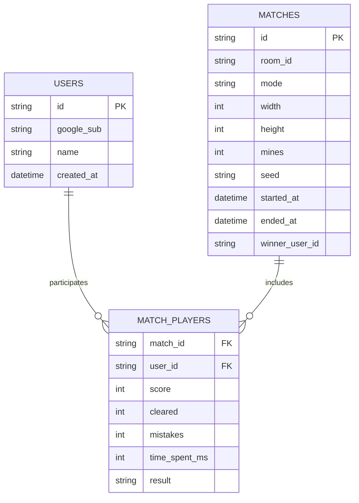

# DB スキーマ設計

- バージョン: 0.2 (ドラフト)
- 更新日: YYYY-MM-DD

## 1. 方針
- MVP: 外部DBなし。ルーム状態は Durable Objects（DO）に保持。
- 将来: 永続化が必要なデータは Cloudflare D1（SQLite）に保存。KV は軽量なキー値用途に使用可。

## 2. DO ストレージ構造（MVP）
- 1 ルーム = 1 Durable Object（`RoomDO`）
- 保存キー（例）
  - `room`: Room メタ `{ id, hostId, players[], settings, state, mode }`
  - `game`: GameState `{ seed, width, height, mines, startedAt, boardHidden, boardPublicByPlayer, flagsShared, progress }`
  - 必要に応じてチェックポイント `checkpoint:{ts}`
- 特性: 強整合・直列実行・揮発性（ルームクローズで破棄、必要に応じて D1 へサマリ書出し）

## 3. ER 図（将来/D1）

## 4. テーブル定義（将来/D1）
- `users`
  - `id` TEXT PRIMARY KEY
  - `google_sub` TEXT NULL
  - `name` TEXT NOT NULL
  - `created_at` DATETIME NOT NULL DEFAULT CURRENT_TIMESTAMP
- `matches`
  - `id` TEXT PRIMARY KEY
  - `room_id` TEXT NOT NULL
  - `mode` TEXT NOT NULL
  - `width` INTEGER NOT NULL
  - `height` INTEGER NOT NULL
  - `mines` INTEGER NOT NULL
  - `seed` TEXT NOT NULL
  - `started_at` DATETIME NOT NULL
  - `ended_at` DATETIME NULL
  - `winner_user_id` TEXT NULL REFERENCES users(id)
- `match_players`
  - `match_id` TEXT NOT NULL REFERENCES matches(id)
  - `user_id` TEXT NOT NULL REFERENCES users(id)
  - `score` INTEGER NOT NULL
  - `cleared` INTEGER NOT NULL
  - `mistakes` INTEGER NOT NULL
  - `time_spent_ms` INTEGER NOT NULL
  - `result` TEXT NOT NULL -- 'win' | 'lose' | 'draw'
  - PRIMARY KEY (`match_id`, `user_id`)

## 5. 参照整合性/制約
- 外部キーは D1 の互換に注意（アプリ側でも整合性を担保）。
- ユニーク制約: `users.google_sub` はユニーク（NULL 可）。

## 6. マイグレーション方針
- 変更はバージョン付き SQL を管理。ロールバック手順を準備。

## 7. KV の用途（任意）
- `daily:seed:{date}` → シード値
- `room:invite:{roomId}` → 招待用一時トークン
- `rate:{ip}` → 軽いレート制限カウンタ
