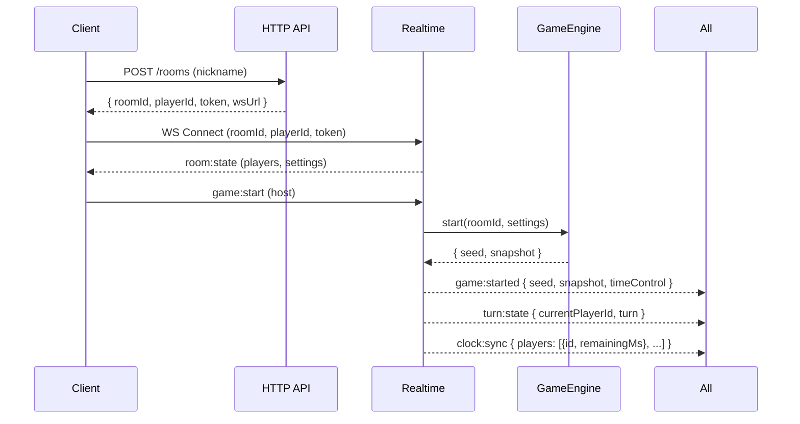
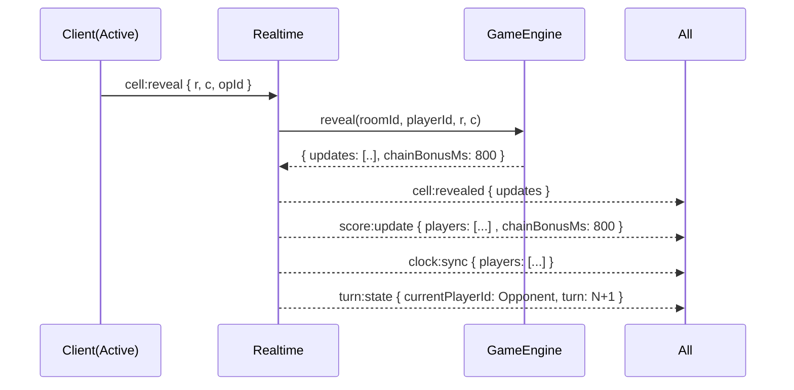
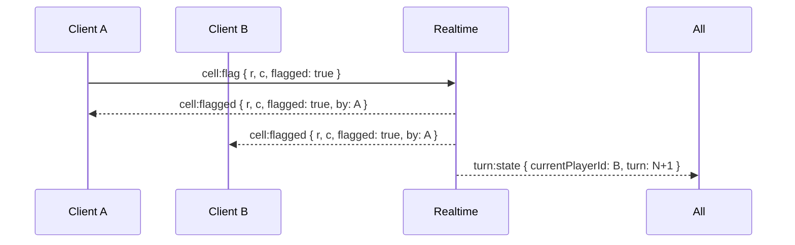
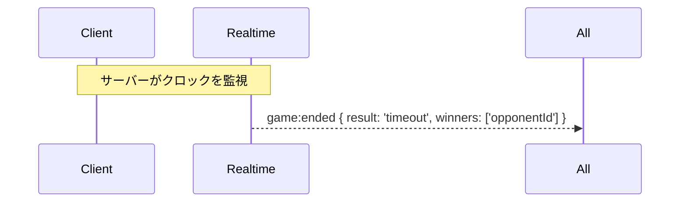
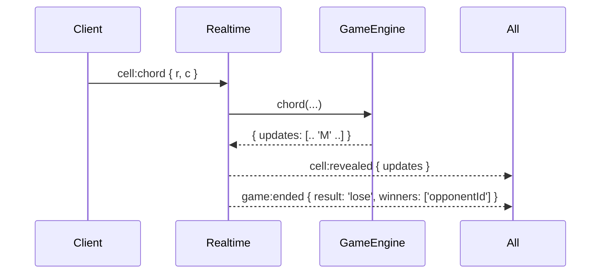

# シーケンス図

- バージョン: 0.5 (ドラフト)
- 更新日: YYYY-MM-DD

## 例1: ルーム参加と同時スタート（ターン制）

```mermaid
sequenceDiagram
  participant C as Client
  participant API as HTTP API
  participant RT as Realtime
  participant GE as GameEngine

  C->>API: POST /rooms (nickname)
  API-->>C: { roomId, playerId, token, wsUrl }
  C->>RT: WS Connect (roomId, playerId, token)
  RT-->>C: room:state (players, settings)
  C->>RT: game:start (host)
  RT->>GE: start(roomId, settings)
  GE-->>RT: { seed, snapshot }
  RT-->>All: game:started { seed, snapshot, timeControl }
  RT-->>All: turn:state { currentPlayerId, turn }
  RT-->>All: clock:sync { players: [{id, remainingMs}, ...] }
```

## 例2: 手番の操作（開く → 連鎖 → ターン交代）

```mermaid
sequenceDiagram
  participant C as Client(Active)
  participant RT as Realtime
  participant GE as GameEngine

  C->>RT: cell:reveal { r, c, opId }
  RT->>GE: reveal(roomId, playerId, r, c)
  GE-->>RT: { updates: [..], chainBonusMs: 800 }
  RT-->>All: cell:revealed { updates }
  RT-->>All: score:update { players: [...] , chainBonusMs: 800 }
  RT-->>All: clock:sync { players: [...] }
  RT-->>All: turn:state { currentPlayerId: Opponent, turn: N+1 }
```

## 例3: 共有フラグの同期

```mermaid
sequenceDiagram
  participant C1 as Client A
  participant C2 as Client B
  participant RT as Realtime

  C1->>RT: cell:flag { r, c, flagged: true }
  RT-->>C1: cell:flagged { r, c, flagged: true, by: A }
  RT-->>C2: cell:flagged { r, c, flagged: true, by: A }
  RT-->>All: turn:state { currentPlayerId: B, turn: N+1 }
```

## 例4: 時間切れ

```mermaid
sequenceDiagram
  participant C as Client
  participant RT as Realtime

  Note over C,RT: サーバーがクロックを監視
  RT-->>All: game:ended { result: 'timeout', winners: ['opponentId'] }
```

## 例5: 誤チョード/地雷ヒットで即終了

```mermaid
sequenceDiagram
  participant C as Client
  participant RT as Realtime
  participant GE as GameEngine

  C->>RT: cell:chord { r, c }
  RT->>GE: chord(...)
  GE-->>RT: { updates: [.. 'M' ..] }
  RT-->>All: cell:revealed { updates }
  RT-->>All: game:ended { result: 'lose', winners: ['opponentId'] }
```
